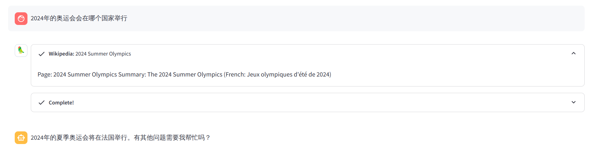
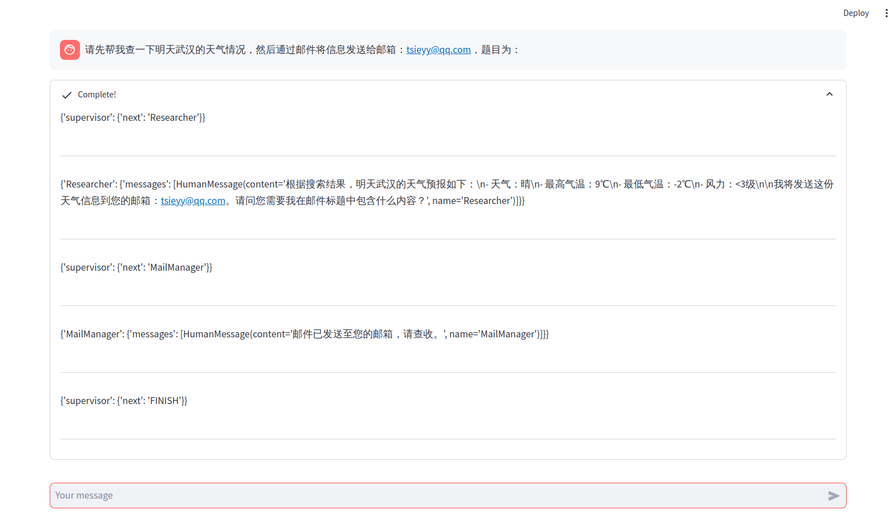

# CCBot (Comprehensive Chat Bot) 

一款使用LangChain和Streamlit构建的综合性聊天机器人，
本项目将机器人分为**普通版本**和**PLUS版本**。

**普通版本：**
在原有OpenAI聊天机器人的基础之上增加了以下功能：
* 使用LangChain的Callback功能，结合streamlit可以显示机器人的思考过程，如下图所示：


* 增加了 *GoogleSearch* 和 _Wikipedia_ 搜索功能，一种机器人只能使用一类Agent, 
所以这里选择了搜索功能的Agent来保证机器人具有即时性，如果需要一个机器人具有多个Agent功能，
可以使用**PLUS**版本的机器人。

**PLUS版本：**
该版本的机器人依赖于 *LangGraph* 在上面普通版本的基础之上进行了以下修改：
* 由于LangGraph与LangChain中的Runnable调用起来有些区别，所以他对Callback貌似并不支持，
这就导致了原先的可以展示思考过程的可视化将无法使用，这里采用了自己实现的可视化展示，
界面并不优美但可以体现机器人的思考过程， 如下所示：


* 使用Multi-Agents，同一个机器人可以使用多个Agent进行协作，达到如上图所示，
将网络搜索功能和Gmail联系起来。

具体的技术实现和更多信息请参考[技术文档](docs/jsyl.md)，
~~该项目仅用于本科顺利毕业，并无什么含金量，仅提供一个思路...~~

## 使用方法

### ❗极为重要的一步❗

LangChain项目依赖很多api,本项目也不例外，如果要正确运行请查看 _‘config_example’_ 目录 下面的配置文件，
将 _config_example_ 目录重命名为 _config_，然后修改好配置文件，这里也说明一下配置文件都是什么，
以及如何进行修改。

**目录树：**

```
.
├── credentials.json    // gmail邮箱的权限文件，具体信息请看LangChain中的Gmail部分
├── .env                // 所有的API token，OpenAI的等等。。。
├── passwd.yaml         // streamlit-authenticator所使用的登陆密码文件（这个项目也用了一个简单登陆管理）
└── token.json          // gmail权限申请之后自动生成的一个token文件，生成方法可以点开这个文件看看
```

### 有关Gmail认证

首先需要查看一下[LangChain官方关于Gmail的实例](https://python.langchain.com/v0.1/docs/integrations/toolkits/gmail/),
里面有介绍如何认证.

在本项目中,按照官方示例的办法获取到了`credentials.json`之后,可以运行`examples/LangChain_Gmail.ipynb`中的代码,
成功运行之后会跳转到一个google认证界面,完成认证后会在`example`目录中创建一个`token.json`文件,将这个文件拷贝到`config`目录中即可.

### 本地运行

本项目使用 *poetry* 作为项目管理工具，需要提前安装好，具体安装过程请自行STFW

```bash
# 安装项目依赖
poetry install

# 切换至poetry环境
poetry shell

# 运行
streamlit run main.py
```

### docker运行

(TODO: 还未完成)

使用虽然docker相关文件已经准备好了,但是使用docker部署会出现[watchdog报错](https://discuss.streamlit.io/t/watchdog-error-when-running-streamlit-in-docker/26865),
可能需要将streamlit降级使用,如果需要使用docker进行部署,可以把`pyproject.toml`中的streamlit版本降低一些. 没有测试过可能还是会有问题.

## 参考

本项目中的部分代码参考自下面的仓库(前两者为官方示例仓库)：

[streamlit-agent](https://github.com/langchain-ai/streamlit-agent)

[langgraph/examples](https://github.com/langchain-ai/langgraph/tree/main/examples/multi_agent)

[gpt_research](https://github.com/assafelovic/gpt-researcher/tree/master/multi_agents)